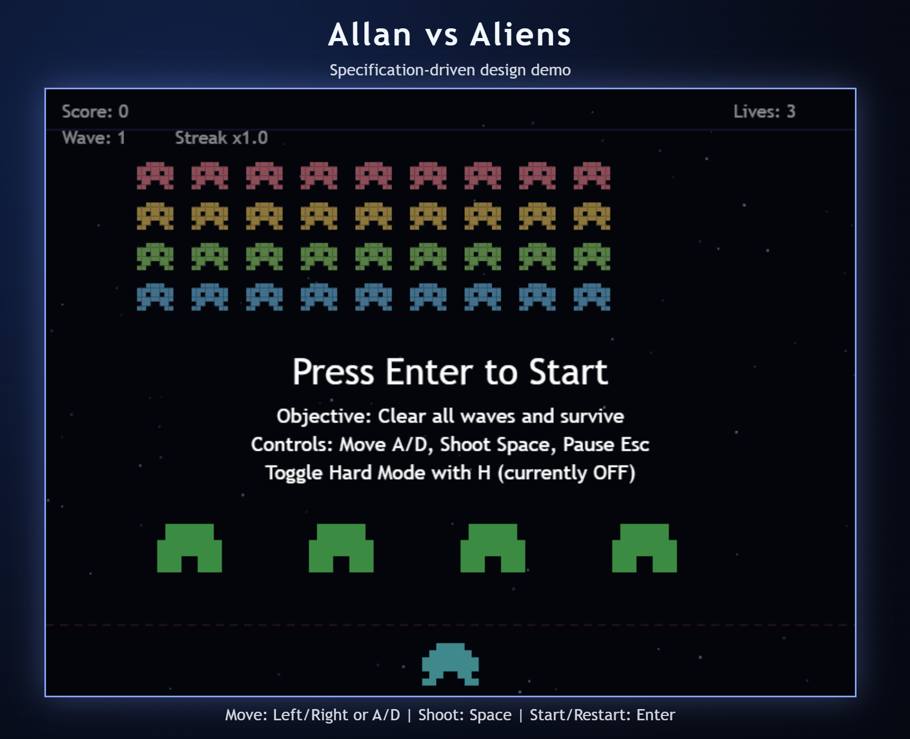

# Allan vs Aliens: GitHub Copilot Specification-Driven Design Experiment

This repository is an experiment in using GitHub Copilot to build a small game through Specification-Driven Design.

## What Specification-Driven Design Means

Specification-Driven Design is a development approach where the team defines clear requirements and acceptance criteria first, then implements code to satisfy those requirements, and finally verifies behavior against the specification.

In practical terms, this project follows a simple loop:

1. Define requirements and acceptance criteria.
2. Implement features that map directly to those requirements.
3. Validate with tests and manual checks.
4. Maintain traceability between requirements, code, and verification.

## Why Use It With GitHub Copilot

Using Copilot in this workflow helps with:

- Turning requirement statements into implementation tasks.
- Keeping documentation and code aligned as features evolve.
- Preserving traceability from requirement IDs to source files and tests.
- Iterating quickly while still grounding changes in explicit acceptance criteria.

## Copilot Modes by Phase

This project workflow fits well with three Copilot Agent modes:

- Ask mode: Best for discovery and clarification.
	Use it to understand existing code, inspect requirement coverage, compare options, and answer focused questions before changing files.
- Plan mode: Best for specification and sequencing.
	Use it to draft or refine requirements, acceptance criteria, implementation steps, and verification plans before coding starts.
- Agent mode: Best for execution.
	Use it to apply spec-first edits, implement code changes, update tests and traceability docs, and run validation commands end-to-end.

Recommended flow in this repository:

1. Ask: Gather context and constraints.
2. Plan: Lock requirements and implementation plan.
3. Agent: Implement, test, and update documentation.

## Where the Specification Documents Are

Core specification documents are in the docs folder:

- docs/spec.md: Primary requirements and acceptance criteria.
- docs/traceability-matrix.md: Mapping from requirements to implementation and verification.
- docs/solid-mapping.md: SOLID-oriented architecture mapping.
- docs/demo-script.md: Demo flow mapped to requirement IDs.
- docs/backlog.md: Deferred items and tradeoff notes.

## Project Scope Note

This project intentionally focuses on a lightweight browser game architecture and a clear requirement-to-code workflow rather than production-grade game engine complexity.
